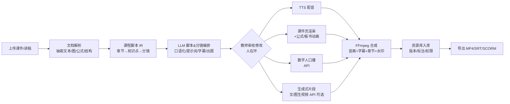

# 《课影》智能教学视频生成平台 — 需求分析文档

> 文档版本：v0.1（初稿，待团队评审）
> 适用范围：本文档对原《高校教学视频课件生成系统》方案进行**架构重定位**——在"无自有算力、不自训/不部署视频大模型"的前提下，改为**接入市面上低成本的生成式 API**来实现，并据此重写技术栈、架构与难点。
> 本文只给出设计思想与选型，不含详细实现代码。

---

## 0. 项目命名

把"课件 / 讲稿 / 知识点"**显影**成"教学视频"，是本系统的本质。据此推荐命名：

| 优先级 | 中文名 | 读音 | 英文/代号 | 寓意 |
|---|---|---|---|---|
| **推荐** | **课影** | Kè Yǐng | **EduCast** | 把"课"显影成"影像"；与视频生成生态（清影/可灵）语感呼应，简短好记 |
| 备选 1 | 知影 | Zhī Yǐng | KnowCast | 把"知识"显影成视频，更偏知识库视角 |
| 备选 2 | 启课 | Qǐ Kè | OpenLesson | 一键开课、开源开放之意 |

下文统一以 **「课影 / EduCast」** 指代本项目（最终名称待团队确认）。

---

## 1. 引言与背景

### 1.1 项目缘起
原方案以开源框架 **Open-Sora** 为基础，计划在教育领域做深度适配，自建教育视频数据集、训练教育领域 CLIP/手势/物理等模型，目标是"生产高质量教学视频数据集"。该路线本质是**一个视频生成大模型的训练 + 部署工程**。

### 1.2 核心约束（决定性变更）
> **团队没有训练/部署视频大模型所需的算力。**

因此放弃"自训模型"路线，改为**接入市面上较便宜的生成式视频 API**。这带来一个根本转变：

- 原架构的"价值核心"是**模型权重**；
- 新架构的"价值核心"是**教育领域的编排工作流（Pipeline）+ 领域知识 + 产品化能力**。

这恰好符合当前 AI 视频行业的趋势：底层模型快速趋同，真正的差异化正从"模型"转移到"**垂直场景的工作流、可控性与可编辑性**"。换言之，做一个**面向高校教学的视频生产中台**，比再造一个视频模型更可行、也更有价值。

### 1.3 一句话定义
> **课影**是一个面向高校教学的视频生产平台：教师上传课件/讲稿，系统自动完成解析、脚本编排、配音、画面合成与数字人讲解，产出带章节导航与字幕的结构化教学视频，并对教学资产做统一管理——**全程不训练模型，所有生成能力通过可插拔的外部 API 提供。**

---

## 2. 原方案 → 新架构 对照（务必先读）

下表把原方案中**依赖自训模型/自有算力**的部分，映射到新架构下的**可行替代方案**。被标为「删除/降级」的指标，建议在新立项文档与答辩材料中不再承诺。

| 原方案能力/指标 | 是否依赖算力 | 新架构处理方式 |
|---|---|---|
| 基于 Open-Sora 训练教育视频模型 | 强依赖 | **删除**。改为调用云端文/图生视频 API |
| EduVideo-1B 预训练数据集、知识蒸馏 83% | 强依赖 | **删除**。无训练环节 |
| 教育领域 CLIP（EdCLIP-ViT-L/14） | 强依赖 | **替换**为 LLM + 提示词工程 +（可选）教材 RAG 检索 |
| 教学行为模拟网络 GestureNet、12 学科手势库、板书轨迹预测 | 强依赖 | **降级**为数字人 API 的"口播 + 预置动作"；自建手势库移出 MVP |
| 实验过程物理仿真（±0.05mm，Unity3D） | 强依赖 | **降级/可选**。复杂物理仿真移出 MVP；数学/公式动画用 manim（CPU 即可） |
| 唇形同步误差 < 120ms | 取决于厂商 | **改为引用所选数字人 API 的指标**，自己只做音画时间轴对齐 |
| 教材版权检测准确率 99.2%、教学伦理审查模型 | 强依赖 | **替换**为 LLM 审核 + 第三方/平台合规接口 + 人工复核 |
| PPTX/PDF → 交互式视频、公式推导动画 | 弱依赖 | **保留（核心）**。文档解析 + 渲染 + 合成，可不依赖大算力 |
| 教学资源管理、水印、版本溯源、知识标注 | 不依赖 | **保留（核心）**。常规后端工程（数据库 + 对象存储 + 水印 + RBAC） |
| 试题/评估视频、学习行为分析 20 种模式 | 部分依赖 | **降级**。评估题与讲解脚本用 LLM 生成；"20 种学习模式识别"移出 MVP |

**结论：** 真正自研的是"解析—脚本—合成—管理"这条**教育视频流水线**，以及一个**可插拔的生成能力适配层**；所有"内容生成"外包给 API。

---

## 3. 项目目标与范围

### 3.1 总目标
让高校教师/教辅人员**无需视频制作技能**，把已有教学材料快速转化为规范、可管理、可复用的教学视频；并沉淀为结构化的教学资产。

### 3.2 范围分期（毕业设计定位）

> 项目性质：**毕业设计 / 课程案例**（单人、演示级、需可答辩可论证）。
> 经确认，下列 **6 个模块全部纳入毕设范围、答辩时均需演示**。因此分期不再"裁剪模块"，而是**先打通全链路最小闭环、再逐个加深功能深度**。每个模块都做到"能跑通、能演示、能讲清设计"即可，不追求生产级规模。

**6 个核心模块（全部必做）**
1. 课件/讲稿导入与解析（PPTX/PDF/Word/纯文本）
2. LLM 脚本与分镜编排（讲稿口语化 + 分镜 + 提示词 + 字幕文本）
3. 配音（TTS）+ 课件页渲染 + 字幕/章节 → 合成成片
4. 数字人讲师口播（画中画）
5. 生成式画面片段（片头/概念演示，文/图生视频 API）
6. 教学资源管理（列表、预览、下载、版本、元数据、水印、权限）
   - 以及贯穿全程的 **Web 控制台**（上传→配置→预览→生成→管理）
   - 以及 **智能评估**（LLM 出题 + 解题讲解脚本/视频）——同样纳入演示

**实施分期（按深度，不按裁剪模块）**
| 阶段 | 目标 | 说明 |
|---|---|---|
| P1 跑通骨架 | 1→2→3→6 串成最小闭环 | PPTX→脚本→TTS+课件渲染→合成 MP4→入库，**先不接数字人/生成视频** |
| P2 接生成能力 | 加 4 数字人、5 生成式片段 | 接入小额付费 API，做出"有讲师、有片头"的完整成片 |
| P3 加深与增强 | 评估出题、公式动画(manim)、章节/水印完善、（可选）SCORM/RAG | 形成可答辩的完整系统 |

**远期/明确降级（写入"未来工作"，不在毕设交付内）**
- 高精度实验物理仿真（±0.05mm 级）、自建学科手势库、板书轨迹预测；
- 多 Provider 成本/质量智能路由、批量流水线、A/B 质量评测（可作"展望"加分）。

### 3.3 不在本项目范围内（明确排除）
- 训练或微调任何视频/CLIP/数字人模型
- 高精度物理仿真（如 ±0.05mm 级实验误差）
- 自建大规模教育视频数据集

---

## 4. 用户角色与干系人

| 角色 | 关注点 | 主要用例 |
|---|---|---|
| 任课教师（主用户） | 省事、可控、内容准确 | 上传课件→生成视频→审核修改→发布 |
| 教学管理员 | 资产统一、版权、权限 | 资源库管理、水印、权限、统计 |
| 学生（间接） | 视频清晰、有章节、可检索 | 观看带章节/字幕的教学视频 |
| 平台运维/开发 | 成本、稳定、可扩展 | 监控任务、配额、Provider 切换 |

---

## 5. 功能需求（按模块，细化）

> 说明：本章描述每个模块的**目标、输入、处理思想、输出、关键子功能**，不含代码。示例课程取**理工科**（如《高等数学》《大学物理》《数据结构》），因此对**公式推导、概念演示、过程动画**有专门强化。

### 5.1 课件智能转换（文档 → 课程脚本 IR）
**目标**：把异构教学文档转成结构化的"课程脚本中间表示（IR）"草稿，作为后续一切生成的统一数据源。

**输入**：PPTX / PDF / DOCX / Markdown / 纯文本 / 课程大纲。

**处理思想（分三层解析）**：
- **物理层**：抽取页/段、文本框、图片、表格、演讲者备注。PPTX 用 python-pptx 取每页文本与备注；PDF 用 PyMuPDF 取文本块、图片与矢量元素。
- **逻辑层**：基于标题层级、页边界、目录，切分为「章节 → 小节 → 知识点」。边界不确定处交人工校对。
- **教学层**：为每个知识点产出"分镜建议"草稿（讲什么、配什么画面）。
- **公式识别（理工科重点）**：识别页面中的公式区域，尽量转为 **LaTeX**（可用公式 OCR 或多模态 LLM 识别），并标注"该公式可做逐步推导动画"。
- **图表关联**：抽取的图片/图表与所属知识点绑定，供后续画面复用。
- **备注即讲稿**：PPT 备注、PDF 旁注作为讲稿初稿喂给 5.2。

**输出**：一份 IR 草稿（章节→知识点→分镜），含文本、图片引用、LaTeX 公式、来源页码。

**关键子功能**：解析结果**可视化校对界面**（纠正章节边界、公式、图片归属、删除无关页）。

**务实承诺**：保真度"尽力而为"，复杂动画、嵌入对象、艺术排版不保证 100% 还原（替代原"无损转换"表述）。

### 5.2 脚本与分镜编排（IR 草稿 → 可生产 IR，LLM 驱动）
**目标**：把"骨架 IR"扩写为"可直接驱动生产的 IR"。

**LLM 承担的任务**：
- **讲稿生成与口语化**：把知识点要点扩写为可朗读的讲解口播稿，控制语气、语速与时长。
- **分镜规划**：决定每个知识点拆成几个分镜（scene），并为每个分镜指定**画面类型**（课件页 / 公式动画 / 数字人 / 生成式片段）。
- **画面提示词**：为"生成式片段"分镜撰写中文提示词（prompt）。
- **字幕与旁白文本**：与讲稿对齐，供后续生成字幕。
- **知识点标注**：打标签、关联教材章节，供检索与评估复用。
- **出题（供 5.6）**：按知识点生成练习题与答案。

**设计思想**：
- **结构化输出**：要求 LLM 严格按 IR 的字段产出（schema 约束），保证机器可消费、人可校对。
- **提示词工程替代 EdCLIP**：把"学科风格、专业术语、受众年级、讲解节奏"写进系统提示，而非训练领域模型。
- **可选教材 RAG**：检索教材语料增强术语与表述准确性（理工科术语尤其重要）。
- **成本控制**：主力用免费/低价 LLM（GLM-4-Flash / DeepSeek）。

**人在环**：教师可逐分镜编辑——改讲稿、切换画面类型、调整顺序、删减分镜。

**理工科特化**：自动识别"需要推导动画"的分镜，标注 LaTeX 推导步骤序列，交给 5.3 的公式动画。

### 5.3 教学视频生成引擎（编排与合成，核心）
**目标**：消费 IR，调度各类画面/音频来源，合成最终视频。

**画面类型（四类，课件优先）**：
- **A. 课件页渲染**：把课件页渲染为画面底图/底视频，叠加轻量动效（缩放平移、要点逐条出现、转场）。最稳、最省、教学最实用，是**主体画面**。
- **B. 公式 / 板书动画（理工科重点）**：将 LaTeX 公式用 **manim** 做**逐步推导显影**（一行行推导、关键项高亮），CPU 即可渲染，无需 GPU。
- **C. 数字人讲师口播**：见 5.4，作为讲解分镜的画面源。
- **D. 生成式片段**：文/图生视频 API 产出片头、概念演示、情景镜头（按需限量）。

**音频与节奏**：
- TTS 按分镜生成旁白音频；**每个分镜时长由旁白音频长度驱动**，保证音画对齐。
- 自动生成 **字幕（SRT/VTT）**，时间轴与旁白对齐。
- 自动生成 **章节导航 / 时间戳书签**（按章节、知识点）。

**合成**：用 **FFmpeg** 按时间轴把"底画面 + 数字人画中画 + 字幕 + 水印 + 转场"拼为成片。

**模板**：原"9 种教学视频模板"落地为**版式 + 流程预设**（微课、慕课、实验演示课、复习课、习题讲解课等），决定片头样式、画中画位置、节奏，而非模型能力。

### 5.4 虚拟教师（数字人，云端 API）
**目标**：用数字人讲师增强讲解的临场感（无 GPU，走云端 API）。

**处理思想**：
- 文本或音频驱动云数字人 API，生成讲师口播片段。
- 形象、语速、风格可选（取决于所选 API）。
- 在合成阶段作为**画中画**叠加于课件之上（位置/大小由模板决定，可全屏/角标切换）。
- **统一由 Provider 适配层调度**；调用失败时**降级**为"纯旁白 + 课件页"，保证视频仍可产出。
- **缓存复用**：相同讲稿生成的数字人片段缓存，避免重复付费。

**理工科用法**：数字人负责"概念讲解、引入、总结"，遇到推导时画面切到公式动画（B 类），分工清晰。

> 因**无 GPU**，不做自建数字人；如周期富余可将"开源数字人 + 免费 GPU 笔记本（Colab/Kaggle/魔搭创空间）"作为对比实验写入论文"未来工作"，非交付必需。

### 5.5 教学资源管理（常规后端工程，核心）
**目标**：把生成产物与中间数据沉淀为可管理、可追溯、可复用的教学资产。

**资源对象（概念数据模型）**：项目 / 课程 → 视频 → 分镜 → 素材（音频、图片、生成片段、数字人片段）；以及 **IR 版本快照**。

**关键子功能**：
- 列表、检索、预览、下载、删除。
- **版本溯源**：每次重生成保存 IR 快照与产物版本，可回溯/对比。
- **知识点标注与检索**：按知识点/标签查找资源。
- **数字版权水印**：可见水印（校徽、课程名、作者）+ 可选隐写水印。
- **权限控制（RBAC）**：教师 / 管理员 / 访客角色。
- **可视化监控面板**：任务状态、生成耗时、累计成本、存储用量。

> 原"50TB 级资产"为容量目标；毕设阶段用本地文件系统即可，存储接口抽象好以便日后换对象存储。

### 5.6 智能评估生成（LLM）
**目标**：基于知识点自动生成练习与讲解，形成"学—练—评"闭环。

**关键子功能**：
- **自动出题**：按知识点生成选择/填空/简答/**计算题（理工科）**，附答案与解析。
- **解题讲解视频**：把解题过程脚本送入 5.3 同一流水线，产出"习题讲解"短视频（可含公式动画）。
- **学习报告**：按知识点覆盖度给出复习建议（基于内容，不做行为追踪）。

**务实边界**：不做原方案"识别 20 种学习模式"等强行为分析；聚焦"基于知识点的题目与讲解生成"。

### 5.7 导出与交付（确认：不对接 LMS，能导出可用即可）
**目标**：产出可直接使用、可归档的成品。

- **视频**：MP4（H.264，常见分辨率 720p/1080p）。
- **字幕**：SRT / VTT。
- **章节**：章节标记文件或内嵌（供常见播放器/平台识别）。
- **封面**：自动生成或选取首帧。
- **打包归档**：可选导出 zip（视频 + 字幕 + 封面 + 脚本 IR + 素材），便于备份与二次编辑。
- **SCORM 轻量包**：列为**可选加分**（非必需，因无需对接 LMS）。

### 5.8 Web 控制台（贯穿全流程）
**目标**：让教师零门槛完成全流程，并可视化异步进度。

**主流程**：上传文档 → 解析结果校对 → 脚本/分镜编辑 → 选择模板/数字人/参数 → 提交生成 → 进度查看 → 预览 → 入库/导出。

**关键体验**：长任务进度可视化（解析中/编排中/生成中/合成中）、关键节点可中断与人工修改、成片在线预览（章节、字幕、书签）。

---

## 6. 非功能需求

| 维度 | 要求 |
|---|---|
| 性能 | 生成为**异步长任务**；MVP 单条 5–10 分钟微课目标在合理时间内完成（受外部 API 排队影响），以"可靠产出"优先于"实时" |
| 成本 | 每个生成任务**预估成本**并受**配额护栏**约束；优先免费/低价档；结果缓存复用 |
| 可靠性 | 外部 API 失败可重试、可降级（fallback 到备用 Provider/纯课件版本）；任务幂等、可断点续跑 |
| 可扩展 | Provider 适配层可插拔；并发限流；水平扩展 worker |
| 安全/合规 | 内容合规审核（LLM + 平台审核 + 人工）；版权水印；权限控制；密钥安全管理 |
| 可用性 | 教师零门槛；关键节点支持预览与人工修改 |
| 可维护 | 中间表示（IR）使解析与生成解耦，便于替换后端与调试 |

---

## 7. 系统架构与设计思想（重点）

### 7.1 七条设计原则
1. **薄模型、厚编排**：不自训模型，价值在教育领域的"解析—脚本—合成—管理"工作流。
2. **Provider 适配层 / 防供应商锁定**：视频、TTS、数字人、LLM 等外部能力统一抽象为接口，可按"成本/质量/额度"路由与热切换，失败自动降级。
3. **异步任务流水线**：生成耗时且多为"提交任务→轮询任务 id→取结果"模式，全流程任务化（提交→轮询→合成→回调），支持重试、限流、幂等。
4. **课件优先、生成式为辅**：主体用课件渲染 + TTS + 数字人，生成式视频仅点缀，压住成本与不可控性。
5. **中间表示（课程脚本 IR/DSL）**：解析与生成解耦；一份结构化脚本可驱动不同后端、便于人工校对与可控编辑。
6. **成本与合规护栏**：预算配额、单任务成本预估、内容合规审核、版权水印、结果缓存。
7. **人在环（Human-in-the-loop）**：脚本、分镜、成片关键节点可由教师审核修改，符合教育严谨性。

### 7.2 分层架构

```
┌───────────────────────────────────────────────────────────┐
│ 表现层  Web 控制台（React） / 视频预览 / 脚本&分镜编辑器       │
├───────────────────────────────────────────────────────────┤
│ 应用层  FastAPI 接口（项目、任务、资源、用户、配额）           │
├───────────────────────────────────────────────────────────┤
│ 编排层  任务流水线（BackgroundTasks）：解析→脚本→媒体生成→合成→入库      │
│        · 课程脚本 IR（JSON DSL）                              │
│        · Provider 适配层（统一接口 + 路由/降级/成本核算）       │
├───────────────────────────────────────────────────────────┤
│ 能力层  文档解析 │ LLM 编排 │ TTS │ 数字人 │ 文/图生视频 │ 合成 │
│        （外部 API）        （外部 API）（外部API）  （FFmpeg） │
├───────────────────────────────────────────────────────────┤
│ 数据层  SQLite（毕设）/ PostgreSQL · 本地文件系统              │
│        ·（可选）Redis 队列 & 对象存储 & 向量库 RAG             │
└───────────────────────────────────────────────────────────┘
```

> **毕设简化说明**：毕设版本使用 SQLite + 本地文件系统 + FastAPI BackgroundTasks 替代架构图中的 PostgreSQL + Redis + MinIO + Celery；Gradio 控制台已弃用，直接使用 React 前端；SCORM 导出未实现，列入未来工作。部署时换 PostgreSQL 和对象存储即可。

### 7.3 核心数据流（Pipeline）



> **关键点：** 「课程脚本 IR」是系统枢纽——解析只负责产出 IR，生成只消费 IR；换任何后端 API 都不影响这条主干。

### 7.4 课程脚本中间表示（IR）概念结构

IR 是一份**分层的结构化脚本**，不绑定任何具体厂商，既能被机器消费、又能被教师校对。概念上分四层：

- **课程（Course）**：标题、学科、年级、目标受众、所选模板、整体风格。
- **章节（Chapter）/ 小节**：标题、顺序、来源页范围。
- **知识点（KnowledgePoint）**：标题、要点、关联标签、来源、（可选）出题种子。
- **分镜（Scene）**：系统最小生产单元，关键字段（概念层面，非代码）：
  - 画面类型：课件页 / 公式动画 / 数字人 / 生成式片段；
  - 旁白文本（讲稿）与字幕文本；
  - 画面规格：课件页引用、LaTeX 公式与推导步骤、图片引用、或生成式提示词；
  - 时长策略（由旁白音频长度驱动）、转场、画中画位置；
  - 知识点标签、来源页码；
  - 生产元数据：所用 Provider、产物地址、版本、成本。

**设计价值**：解析与生成解耦；同一份 IR 可换不同后端重生成；教师在 IR 层校对即可控制成片；版本溯源即对 IR 快照管理。建议后续单独产出 IR 的 **JSON Schema** 作为接口契约。

### 7.5 Provider 适配层（防供应商锁定 + 成本/质量路由）

把所有外部生成能力抽象为四类**能力接口**（概念层面）：文生/图生视频、TTS 配音、数字人口播、LLM 文本。每类接口统一"请求 → 任务 → 结果"的形态，对上层屏蔽各家差异。

- **统一适配**：各厂商（CogVideoX、通义万相、可灵、海螺；Edge-TTS、各云 TTS；智影、HeyGen；GLM、DeepSeek）实现同一接口。
- **路由策略**：按"免费优先 / 成本优先 / 质量优先 / 额度可用性"选择后端，可配置。
- **降级链（fallback）**：首选失败→次选 Provider→最终降级（如数字人失败则纯旁白+课件，仍能出片）。
- **成本核算**：每次调用记录用量与费用，汇总到任务与监控面板。
- **缓存**：相同输入（讲稿/提示词/参数）命中缓存直接复用，避免重复付费。

> 这是本系统应对"API 涨价/限额/下线"和"控制成本"的核心机制，也是答辩的工程亮点之一。

### 7.6 异步任务流水线（可靠性机制）

由于多数生成 API 是"提交任务→轮询任务 id→取回结果"的异步模式，整条流水线按**任务状态机**组织（概念）：

`待处理 → 解析中 → 编排中 → 待审核(人在环) → 生成中(并行子任务：TTS/公式/数字人/生成式) → 合成中 → 完成 / 失败`

- **轮询与回调**：对外部异步任务定时轮询或接收回调，更新子任务状态。
- **重试与幂等**：子任务失败按策略重试；以输入指纹保证幂等，避免重复扣费。
- **断点续跑**：已完成的子任务产物落库，整体重跑时跳过、只补失败项。
- **并发限流**：尊重各 API 的 QPS/并发限制，排队削峰。
- **进度透出**：状态实时反映到控制台，长任务可观测、可中断。

### 7.7 合规与成本护栏

- **内容合规**：用 LLM + 平台审核接口对脚本与提示词做敏感/版权检查，关键处人工确认（替代原"自训审查模型"）。
- **版权**：教材内容"检索/转述"而非整段搬运；成片加水印；保留来源标注。
- **成本护栏**：单任务**生成前成本预估**、项目级**配额上限**、超额拦截、免费档优先——防止生成视频按秒计费导致超支。

---

## 8. 技术栈选型（确定）

### 8.1 后端
> 毕设为单人、单用户演示，下表"毕设简化"列给出可降低复杂度的做法；括注的完整方案留作"未来工作/可扩展性"论证。

| 类别 | 选型 | 毕设简化做法 |
|---|---|---|
| 语言 | **Python 3.11+** | 同 |
| Web 框架 | **FastAPI** | 同 |
| 任务队列 | Celery + Redis（或 RQ/Dramatiq） | **可用 FastAPI BackgroundTasks + 数据库任务表**起步；Celery 作为"可扩展性"亮点选做 |
| 文档解析 | **python-pptx, PyMuPDF(fitz), pdfplumber, mammoth, Pillow** | 同 |
| 媒体合成 | **FFmpeg（核心）, MoviePy** | 同（必备） |
| 公式/动画 | **manim, KaTeX/MathJax, Matplotlib** | 数学动画 CPU 即可 |
| 数据库 | PostgreSQL | **毕设可用 SQLite** 起步，部署时再换 PostgreSQL |
| 缓存/Broker | Redis | 若不上 Celery，可暂不引入 |
| 对象存储 | MinIO / 云 OSS | **毕设可直接用本地文件系统**，接口抽象好以便日后换 OSS |
| 向量库（可选） | pgvector / Chroma / FAISS | 仅做 RAG 增强时引入 |

### 8.2 前端
| 类别 | 选型 | 理由 |
|---|---|---|
| MVP 控制台 | **Gradio / Streamlit** | 快速验证流水线（原方案已含 Gradio 4.12） |
| 正式版 | **React + TypeScript + Vite + Ant Design** | 中文后台体验好，组件成熟 |
| 视频预览 | **video.js / Plyr** | 章节、字幕、时间戳书签 |

### 8.3 部署
- **Docker + docker-compose** 单机即可（重计算都在云端 API）。
- **不需要 GPU 服务器**——这是相对原方案最大的省钱点。一台普通云主机/校内服务器跑后端 + 队列 + FFmpeg（CPU）即可。
- 仅当选择**自建数字人（HeyGem）或大量 manim 渲染**时，才需一块消费级 GPU（可选）。

---

## 9. 外部 API 选型与成本（需以各官网实时价格为准）

> 说明：以下为 2025–2026 年公开资料的概况，**单价波动较大、补贴频繁，立项前请逐家核实最新官网定价与免费额度**。设计上通过"Provider 适配层"做到可随时更换。

### 9.1 文 / 图生视频（用于片头与概念片段，非主体）
| 提供方 | 模型/产品 | 接入方式 | 成本特征 | 备注 |
|---|---|---|---|---|
| **智谱 BigModel** | CogVideoX / **CogVideoX-Flash** | 开放平台 API（按次计费，Flash 档有免费/极低价） | **最适合零预算起步** | 任务 id 轮询模式，支持文/图生视频 |
| 阿里云百炼 | 通义万相 文生视频 | DashScope API | 有免费额度 | 中文友好 |
| 快手 | 可灵 Kling | 开放平台 API | 质量高、单价偏高 | 加分镜头用 |
| MiniMax | 海螺视频 | 开放平台 API | 运镜/情绪强 | 备选 Provider |
| 字节火山引擎 | 即梦/豆包 Seedance | 火山引擎 API | 速度快 | 备选 Provider |

> 行业实测单价约**每秒几毛到一元出头**不等（随平台与档位变化很大），生成式片段务必"按需、限量"，并做缓存复用。

### 9.2 数字人 / 虚拟教师
| 提供方 | 产品 | 接入 | 特征 |
|---|---|---|---|
| 硅基智能 | **DUIX / HeyGem（开源）** | API 或**自建（单卡可跑）** | HeyGem 开源、可离线，预算极低时可自建 |
| 腾讯 | 智影 | 平台/API | 文本驱动口播，与微信生态衔接 |
| HeyGen / D-ID | 海外 | API | 多语种、效果好，单价较高 |

### 9.3 TTS（配音）
| 提供方 | 特征 |
|---|---|
| **Edge-TTS（免费）** | 零成本起步首选 |
| 阿里云 / 火山 / Azure / MiniMax TTS | 音质更好、可定制音色，进阶使用 |

### 9.4 LLM（脚本、分镜、出题、审核）
| 提供方 | 特征 |
|---|---|
| **智谱 GLM-4-Flash（免费档）** | 零成本起步首选 |
| DeepSeek / 通义千问 Qwen | 性价比高，可作主力或备选 |

### 9.5 毕设落地配置（免费为主 + 小额付费）

> 预算策略已确认：**免费为主，可接受买一点 API**。原则——**绝大多数环节用免费/开源，只在"答辩必须演示、免费档不够稳"的两处花小钱**（数字人口播、少量生成式片段）。

| 模块 | 毕设推荐配置 | 现金成本 | 说明 |
|---|---|---|---|
| ① 文档解析 | python-pptx / PyMuPDF / mammoth | **0** | 本地库，纯免费 |
| ② 脚本&分镜编排 | GLM-4-Flash（免费）或 DeepSeek（极低价） | **≈0** | 免费档足够；DeepSeek 调用也仅几分钱级 |
| ③ 配音 TTS | **Edge-TTS（免费）** | **0** | 微软在线 TTS，中文音色可用；要更好音色再上付费 |
| ③ 课件渲染/公式动画 | FFmpeg + manim + Matplotlib | **0** | 本地 CPU 渲染 |
| ④ 数字人口播 | 智影/蝉镜免费档起步；**演示用小额付费档**保稳定，或自建 HeyGem 跑免费 GPU（Colab/Kaggle/魔搭创空间） | **小额（约几十~百元）** | 真正不可控的一块，建议演示视频用付费档生成、缓存复用 |
| ⑤ 生成式片段 | CogVideoX-Flash（免费）/ 通义万相（免费额度）起步；关键镜头**小额付费**（可灵/CogVideoX 正式档） | **小额（按秒计，几元~几十元）** | 只做片头/概念演示，**按需限量 + 缓存**，不做长片 |
| ⑥ 资源管理 | SQLite + 本地文件系统 + FFmpeg 水印 | **0** | 常规后端工程 |
| 评估出题 | GLM-4-Flash / DeepSeek | **≈0** | LLM 出题 + 解题脚本，复用主流水线产出讲解视频 |

> **毕设演示总成本估算：通常控制在 ¥100~¥300 即可**（主要花在数字人和十来个生成式短片段上，且一次生成、反复用于答辩）。

**两处"难点"在小额付费下的处理：**
- **数字人**：零成本自建（HeyGem/Wav2Lip/SadTalker 跑免费 GPU 笔记本）可行但工程量大、稳定性差；**答辩可靠性优先**，建议用云数字人小额付费档生成几段固定讲师口播并缓存。若想增加技术含量与论文工作量，可"自建数字人"作为对比实现写进论文。
- **生成式片段**：免费档（CogVideoX-Flash / 通义万相免费额度）做日常调试，**少数最终要进成片的镜头**用付费档生成；务必"按需、限量、缓存复用"，并在系统里做**单任务成本预估 + 配额护栏**（这本身就是一个答辩亮点）。

---

## 10. 关键技术难点（重写，务实版）

原方案难点是"训练难点"；新架构难点是"**编排与工程难点**"：

1. **异步长任务编排的可靠性**：多 API 的"提交→轮询→取回"，需重试、幂等、限流、超时与失败降级。
2. **多 Provider 适配与质量/成本路由**：统一接口屏蔽各家差异，按预算与质量选择后端。
3. **跨分镜画面一致性**：生成式视频的角色/风格一致性是行业公认难点——本项目以"课件优先"策略规避，生成式仅做点缀。
4. **文档解析保真**：复杂 PPT/公式/图表 → 结构化 IR 的准确率，需配人工校对兜底。
5. **音画 / 字幕 / 数字人口型对齐**：自己只做时间轴对齐，口型精度依赖所选 API。
6. **成本可控**：生成视频按秒/次计费，极易超支——需成本预估、配额护栏、缓存。
7. **内容合规与版权**：教材版权用"检索 + 提示"而非搬运；输出加水印；合规审核用 LLM + 平台接口 + 人工复核。

---

## 11. 风险与对策

| 风险 | 影响 | 对策 |
|---|---|---|
| API 涨价/下线/限额 | 成本与可用性 | Provider 适配层 + 多家备份 + 降级到纯课件版本 |
| 生成质量不可控 | 教学可用性 | 课件优先；人在环审核；模板化 |
| 成本超支 | 预算 | 配额护栏 + 单任务成本预估 + 缓存复用 + 免费档优先 |
| 文档解析失真 | 内容准确 | 人工校对界面；逐步支持更多版式 |
| 教材版权风险 | 合规 | 不搬运原文；水印；合规审核；教师确认 |
| 范围全做但工期紧 | 交付 | 先打通 P1 骨架闭环，再逐模块加深；加分项（SCORM/RAG/自建数字人）可随时取舍，不阻塞主线 |

---

## 12. 实施路线图（毕设版）

| 阶段 | 目标 | 交付物 | 现金成本 |
|---|---|---|---|
| P1 跑通骨架 | ①②③⑥ 最小闭环 | Gradio 控制台：PPTX→脚本→Edge-TTS+课件渲染→合成 MP4→SQLite 入库 | 0 |
| P2 接生成能力 | 加 ④数字人、⑤生成式片段 | 含讲师口播与片头的完整成片；成本预估与配额护栏 | 小额 |
| P3 加深增强 | 评估出题、manim 公式动画、字幕/章节/水印完善、React 控制台 | 可答辩的完整系统 | ≈0 |
| 加分（选做） | SCORM 导出、RAG 教材增强、自建数字人对比实现、Celery 异步队列 | 论文"未来工作/可扩展性"佐证 | ≈0 |

---

## 13. 毕设创新点与工作量论证

> 毕设答辩常被追问"你的创新与工作量在哪"。在"调用 API"的架构下，必须把价值讲在**编排与工程**上，建议从以下角度组织论文：

1. **领域化的"课程脚本中间表示（IR/DSL）"设计**：把异构教学文档统一抽象为可驱动多后端、可人工校对的结构化脚本——这是本系统的原创性枢纽，可作为核心贡献。
2. **可插拔的生成能力适配层**：统一封装视频/TTS/数字人/LLM 多家异构 API，支持降级与成本核算——体现软件架构能力。
3. **异步生成流水线的工程实现**：针对"提交→轮询→合成"的可靠性问题（重试、幂等、限流、缓存）给出方案与实测——真实工程难点。
4. **成本可控机制**：单任务成本预估 + 配额护栏 + 缓存复用，并给出实测成本数据——务实且有数据支撑。
5. **教育场景适配**：课件优先策略、知识点标注、章节导航、字幕、水印与版权处理、人在环审核——领域 know-how。
6. **效果评估**：用少量样例做主观/客观评测（生成耗时、成本、教师可用性问卷），把"系统好用"量化。

> 论文写作提示：原方案里的 ±0.05mm、唇形<120ms、99.2%、EduVideo-1B 等指标**不要再写为自研成果**；凡涉及生成质量/口型精度，统一表述为"依赖所选第三方 API 的能力"，自研部分聚焦上面 6 点。

---

## 14. 附：理工科端到端示例走查

以《高等数学》"导数的定义"一节为例，说明系统怎么把一份 PPT 变成教学视频（仅描述流程，不含代码）：

1. **上传与解析**：教师上传该节 PPT。系统抽取出 3 个知识点——"平均变化率""瞬时变化率与极限""导数定义式"，并把页面里的极限与导数公式识别为 LaTeX，标注"可做推导动画"。教师在校对界面确认章节与公式无误。
2. **脚本与分镜编排**：LLM 把每个知识点扩写为口语化讲稿，并规划分镜——
   - 片头（生成式片段，5 秒，提示词："数学课堂、简洁、粉笔风格"）；
   - 概念引入（数字人讲师口播，讲"什么是变化率"）；
   - 公式推导（公式动画，manim 逐步显影从平均变化率到极限到导数定义）；
   - 配合课件页展示例题；
   - 小结（数字人）。
   并同步生成字幕文本与 2 道练习题。
3. **教师审核**：教师觉得推导节奏偏快，在分镜里把推导动画时长调长、补一句旁白。
4. **媒体生成（并行子任务）**：Edge-TTS 生成各分镜旁白；manim 渲染公式推导动画（CPU）；云数字人 API 生成讲师口播片段并缓存；CogVideoX 生成 5 秒片头（按需、限量）。成本护栏在提交前预估总花费并提示。
5. **合成**：FFmpeg 按时间轴拼接"底画面 + 数字人画中画 + 字幕 + 校徽水印 + 转场"，每个分镜时长由旁白音频驱动，自动打章节标记。
6. **入库与导出**：成片连同 IR 快照、素材入资源库（带知识点标签、版本号）；导出 MP4 + SRT + 章节 + 封面，或打包 zip 归档。
7. **评估（可选）**：第 2 步生成的练习题，可再走一遍流水线产出"习题讲解"短视频。

> 这条走查同时覆盖了全部 6 个模块，可直接作为答辩演示脚本。

---

## 附录 A：确认状态与后续产出

**已全部确认：**
- 项目性质：**毕业设计 / 课程案例**（单人、演示级、需可论证）。
- 预算：**免费为主，可接受小额付费 API**（演示成本预计 ¥100~¥300）。
- 范围：**6 个模块全部实现并演示**；周期较充足，可纳入加分项（公式动画、评估、可选 SCORM）。
- 算力：**无 GPU** → 数字人走云端 API；公式动画用 manim（CPU）；不做自建数字人（如周期富余，可用免费 GPU 笔记本做对比实验写入"未来工作"）。
- 示例课程：**理工科**（建议《高等数学》或《大学物理》，突出公式推导与概念动画）。
- 对接：**不对接 LMS**；交付物为可用的导出文件（MP4 + 字幕 + 章节，可选 zip/SCORM）。

**建议的后续产出（按需逐项细化）：**
1. 课程脚本 IR 的 **JSON Schema**（接口契约）。
2. **数据库 ER 图**（课程/视频/分镜/素材/版本/用户/任务/成本）。
3. **Provider 适配层接口规范**（四类能力接口的字段与状态）。
4. 各模块**功能清单与验收标准**（逐条可勾验）。
5. **成本测算表**（按演示规模估算各 API 用量与费用）。
6. **论文大纲**（绪论/相关技术/需求分析/系统设计/实现/测试与评估/总结展望）。
